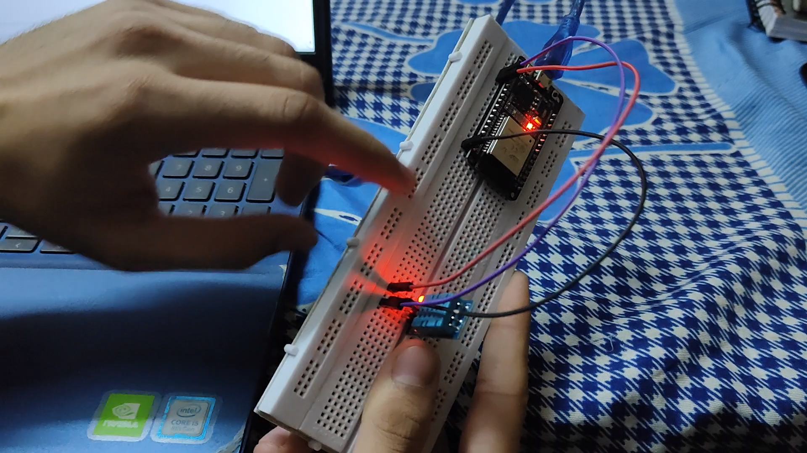

# Task 2: IoT Data Logging with Live Graph (ESP32)

## Visuals

### Live Data Graph

The following image shows the live graph of sensor data displayed on the web page.

### Circuit Diagram

This image shows the circuit diagram for connecting the DHT11 sensor to the ESP32.

### Serial Monitor Output

This image shows the output from the serial monitor, including the IP address of the ESP32.

This document guides you through setting up a local web server on an ESP32 to display sensor data with a live-updating graph.

## Goal

Send sensor readings to a local web dashboard and visualize them in a live graph.

## Requirements

*   ESP32 Development Board
*   DHT11 sensor
*   Arduino IDE with ESP32 board support

## Steps

1.  **Set up the Arduino IDE:**
    *   Install the ESP32 board package:
        1.  Go to `File > Preferences`.
        2.  Add `https://raw.githubusercontent.com/espressif/arduino-esp32/gh-pages/package_esp32_index.json` to the "Additional Boards Manager URLs".
        3.  Go to `Tools > Board > Boards Manager`.
        4.  Search for `esp32` and install the package.
        5.  Select your ESP32 board from `Tools > Board`.
    *   Install the DHT sensor library:
        1.  Go to `Sketch > Include Library > Manage Libraries`.
        2.  Search for `DHT sensor library` by Adafruit and install it.

2.  **Connect the hardware:**
    *   Connect the DHT11 sensor to the ESP32 as follows:
        *   Sensor VCC to ESP32 3V3
        *   Sensor GND to ESP32 GND
        *   Sensor Data to ESP32 GPIO23 (or any suitable digital pin)

3.  **Write the code:**
    *   Open the `task2.ino` file in the Arduino IDE.
    *   Update the `ssid` and `password` variables with your Wi-Fi credentials.
    *   Upload the code to your ESP32.

4.  **Test the setup:**
    *   Open the Serial Monitor to see the IP address of the ESP32.
    *   Press the EN/Reset button after flashing the code if necessary.
    *   Open a web browser and enter the IP address to see the sensor readings displayed on a live-updating graph.

## Mandatory Libraries and Code Pre-requisites

Before proceeding, ensure you have the following libraries and tools installed:

1. **Arduino IDE**: Download and install the latest version of the Arduino IDE from the [official website](https://www.arduino.cc/en/software).

2. **ESP32 Board Package**: Follow the steps in the "Set up the Arduino IDE" section to install the ESP32 board package.

3. **DHT Sensor Library**: Install the `DHT sensor library` by Adafruit as described earlier.

4. **WiFi Library**: The `WiFi.h` library is included with the ESP32 board package.

5. **WebServer Library**: The `WebServer.h` library is also included with the ESP32 board package.

These libraries are essential for compiling and running the `task2.ino` sketch successfully.

## Code Explanation

The `task2.ino` sketch does the following:

*   Includes the necessary libraries: `WiFi.h`, `WebServer.h`, `DHT.h`, and `<vector>`.
*   Defines the Wi-Fi credentials and the DHT sensor pin.
*   Initializes the DHT sensor and the web server.
*   Uses `std::vector` to store a history of the last 20 temperature and humidity readings.
*   In the `setup()` function, it connects to Wi-Fi and starts the web server with two endpoints:
    *   `/`: Serves the main HTML page which includes the chart.
    *   `/data`: Provides the sensor data history in JSON format.
*   The `loop()` function does two things:
    1.  Handles incoming client requests.
    2.  Reads the sensor every 5 seconds using a non-blocking timer (`millis()`) and updates the data history.
*   The `handleRoot()` function sends an HTML page to the client. This page contains:
    *   A `<canvas>` element for the chart.
    *   A reference to the Chart.js library from a CDN.
    *   JavaScript code to fetch data from the `/data` endpoint every 5 seconds and update the chart.
*   The `handleData()` function constructs and sends a JSON object containing the temperature and humidity history.
*   To view the output, open the Serial Monitor with a baud rate of 115200.

