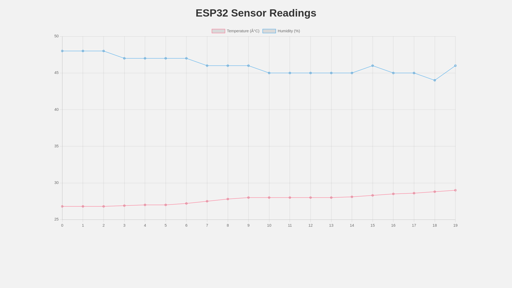
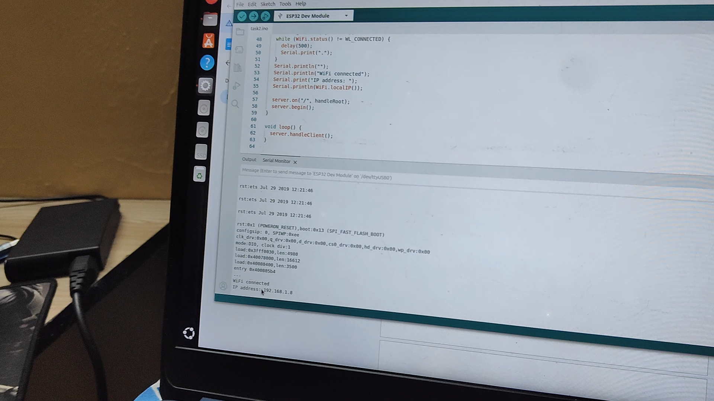

# Task 2: IoT Data Logging with Live Graph (ESP32)

## Visuals

### Live Data Graph

The following image shows the live graph of sensor data displayed on the web page.

### Circuit Diagram

This image shows the circuit diagram for connecting the DHT11 sensor to the ESP32.

### Serial Monitor Output

This image shows the output from the serial monitor, including the IP address of the ESP32.

This document guides you through setting up a local web server on an ESP32 to display sensor data with a live-updating graph.

## Goal

Send sensor readings to a local web dashboard and visualize them in a live graph.

## Requirements

*   ESP32 Development Board
*   DHT11 sensor
*   16x2 I2C LCD Display
*   Buzzer
*   Arduino IDE with ESP32 board support

## Steps

1.  **Set up the Arduino IDE:**
    *   Install the ESP32 board package (see instructions below).
    *   Install the required libraries: `DHT sensor library` by Adafruit and `LiquidCrystal_I2C`.

2.  **Connect the hardware:**
    *   Connect the components to the ESP32 as follows:
        *   **DHT11 Sensor:**
            *   VCC to ESP32 3V3
            *   GND to ESP32 GND
            *   Data to ESP32 **GPIO27**
        *   **I2C LCD Display:**
            *   VCC to ESP32 5V or Vin
            *   GND to ESP32 GND
            *   SDA to ESP32 **GPIO25**
            *   SCL to ESP32 **GPIO26**
        *   **Buzzer:**
            *   Positive (+) leg to ESP32 **GPIO14**
            *   Negative (-) leg to ESP32 GND

3.  **Write the code:**
    *   Open the `task2.ino` file in the Arduino IDE.
    *   Update the `ssid` and `password` variables with your Wi-Fi credentials.
    *   Upload the code to your ESP32.

4.  **Test the setup:**
    *   **Open Serial Monitor:** In Arduino IDE, go to `Tools > Serial Monitor`.
    *   **Set Baud Rate:** Ensure the baud rate (bottom right corner of Serial Monitor) is set to **115200**.
    *   **Reset ESP32:** Press the **EN** or **RST** button on your ESP32 board. You should see connection logs and finally an IP address (e.g., `192.168.1.x`).
    *   **Check LCD:** The LCD should show "Online!" and the IP address.
    *   **Access Web Dashboard:**
        *   Ensure your computer/phone is connected to the **same Wi-Fi network** as the ESP32.
        *   Open a web browser (Chrome, Firefox, etc.).
        *   Enter the IP address shown on the LCD or Serial Monitor (e.g., `http://192.168.1.x`).
    *   **Monitor Data:** You should see the sensor readings and a live-updating graph on the webpage.

## Troubleshooting

### "Failed to read from DHT sensor!"
If you see this error in the Serial Monitor:
1.  **Check Wiring:** Ensure the data pin of the DHT11 is securely connected to **GPIO 27**. Verify VCC (3.3V/5V) and GND are correct.
2.  **Pull-up Resistor:** If you are using a **standalone 4-pin DHT11 sensor** (blue casing, no PCB), you need a 10kΩ resistor connected between the **VCC** and **Data** pins. If you are using a 3-pin module (sensor on a small board), this resistor is usually built-in.
3.  **Power:** Try switching the VCC connection from 3.3V to 5V (or vice versa) if supported by your specific module.
4.  **Defective Sensor:** Try a different DHT11 sensor if available.

### LCD Not Showing Text
1.  **Adjust Contrast:** Use a screwdriver to turn the potentiometer (blue box) on the back of the I2C module until text appears.
2.  **Check Address:** The code uses address `0x27`. If your LCD uses `0x3F`, change `LiquidCrystal_I2C lcd(0x27, 16, 2);` to `LiquidCrystal_I2C lcd(0x3F, 16, 2);` in the code.

## Mandatory Libraries and Code Pre-requisites

Before proceeding, ensure you have the following libraries and tools installed:

1.  **Arduino IDE**: Download and install the latest version.
2.  **ESP32 Board Package**: Follow the setup steps.
3.  **Install Libraries via Arduino IDE Library Manager:**
    *   Open Arduino IDE.
    *   Go to `Sketch > Include Library > Manage Libraries...`.
    *   Search for "DHT sensor library" by Adafruit and install it.
    *   Search for "LiquidCrystal I2C" and install it. (Ensure you install a version compatible with ESP32. You can try "LiquidCrystal I2C" by Frank de Brabander, or "LiquidCrystal I2C" by Marco Schwartz if the former is not available).
4.  **Wire Library**: Included with the ESP32 package, used for I2C communication.
5.  **WiFi & WebServer Libraries**: Included with the ESP32 package.

These libraries are essential for compiling and running the `task2.ino` sketch successfully.

## Code Explanation

The `task2.ino` sketch does the following:

*   Includes necessary libraries: `WiFi.h`, `WebServer.h`, `DHT.h`, `Wire.h`, `LiquidCrystal_I2C.h`, and `<vector>`.
*   Defines the Wi-Fi credentials and pins for the DHT sensor, buzzer, and I2C LCD.
*   Initializes all hardware components (DHT, LCD, Buzzer) and the web server.
*   In the `setup()` function, it connects to Wi-Fi, initializes the I2C bus and LCD, and starts the web server with two endpoints:
    *   `/`: Serves the main HTML page which includes the live-updating chart.
    *   `/data`: Provides the sensor data history in JSON format.
*   The `loop()` function handles incoming client requests and reads the sensor every 5 seconds using a non-blocking timer.
*   The `readSensorData()` function reads temperature and humidity. It then calls `updateLcd()` to display the values. If the sensor fails, it shows an error on the LCD and calls `triggerBuzzer()`.
*   The `updateLcd()` function clears the LCD and prints the current temperature and humidity on separate lines.
*   The `triggerBuzzer()` function activates the buzzer for a short duration to provide an audible alert.
*   The web interface remains the same, providing a remote dashboard for monitoring sensor data graphically.

